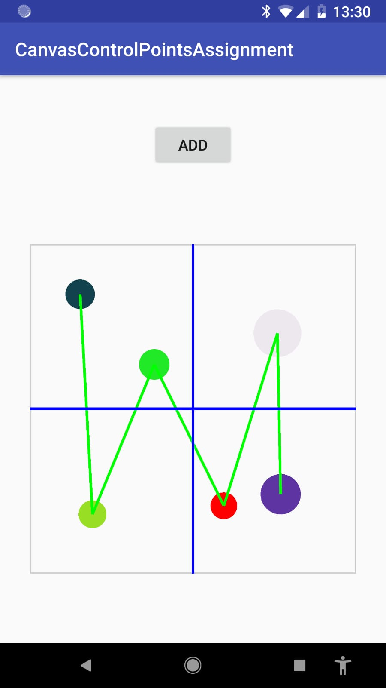

## Canvas control Points in Android

This android application demonstrate a custom layout component which call **Pit**.

### General description of `Pit`:
* `Pit` is a ViewGroup that renders an interactive horizontal 2D graph of points, between every point there is a connected edge (linear edge).
* every point of Pit is draggable, I didn't use on purpose the built in Android drag functionality (i.e View.startDrag() etc..). I write the draggable functionality by my own via `OnTouchListener`.
* `Pit` also draws the Origin axis lines
* when a point is dragged, the view is rendered again in order to show the edges,
that means Pit is responsive :)
* `Pit` also has a very unique feature, the reordering feature which goes like this:
if a user drags a point before or after another point, then Pit will change that point
order and therefore the edges will still render beautifully.
* `Pit` have an interface to add point/s:
  - every point is added at the origin axis (0, 0). 
  - The Pit  radius set randomly.
  - The Pit color select randomly. 
* `Pit` start with 5 different initial points.

# illustration of Pit

# Architecture:
The application develop base MVP design pattern as described below:

# Tecnolegis:
ConstraintLayout - Allows you to position and size widgets in a flexible way.

Butter Knife - Field and method binding for Android views which uses annotation processing to generate boilerplate code.

This project build as [home assignment](https://github.com/HendrixString) as part of work acceptance at [shutterfly](https://github.com/shutterfly).

License
----

MIT

**Free Software, Hell Yeah!**

